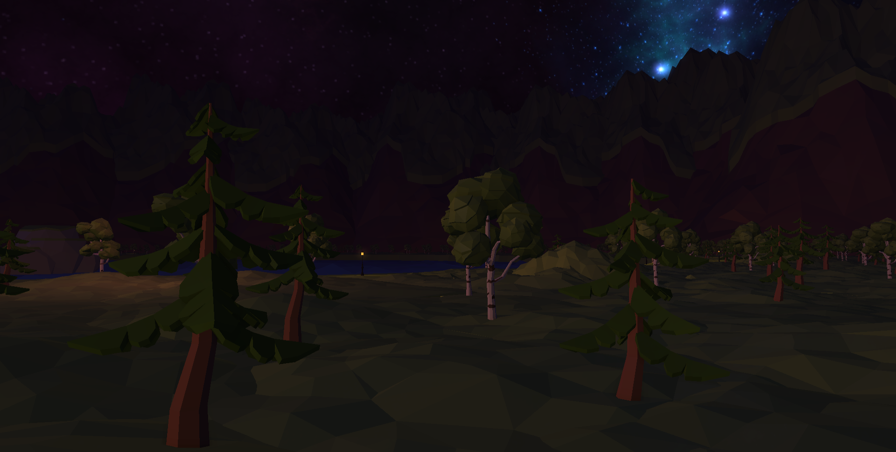

# 基于OpenGL的场景渲染器

## 概述

这是一个基于OpenGL 4.3开发的渲染器，主要用于个人实践。

渲染器展示了一个大型场景，一共有980个物体被渲染，以及49盏灯。

场景使用Unity搭建，搭建完成之后导出到该渲染器进行渲染。

该渲染器包含了以下技术：

- 天空盒(Skybox)

- 后期处理(Post Processing)

- GPU实例化(GPU Instancing)

- 延迟渲染(Deferred Shading)

- 点光源阴影(Omnidirectional Shadow Map)

- 屏幕空间环境光遮蔽(SSAO)

- GameObject-Component框架

- 多渲染通道(Multi-pass Rendering)

演示视频，请点击B站链接：[视频链接](【图形学作品——OpenGL场景渲染】 https://www.bilibili.com/video/BV1mEN1zvETr/?share_source=copy_web&vd_source=dc9fa2b045c2ba1ee124d1c1692e6814)

以下是调试信息，显示了物体数量，以及场景展示截图

## 引擎的操作方式

- 移动：跟虚幻引擎和Unity引擎类似，按住鼠标右键，然后再按住W、A、S、D、Q、E键就可以移动，在移动的时候滚动鼠标滚轮，可以改变移动速度

- 选中GameObject：由于引擎目前还没有做射线检测，所以只能用键盘的左右箭头进行对象选择

- 世界设置面板：世界设置面板在软件的左边，用于设置环境光之类的世界参数

- 检查器面板：在选中GameObject之后，可以显示其详细信息，可以点击面板上的按钮，调节该对象上的参数

## 项目结构

- 3rdParty：第三方库

- AssetClass：资产所对应的C++类，比如Mesh, Texture

- Component：挂载在GameObject身上的组件类

- Config：用于构建的配置头文件

- Core：核心模块，用于驱动整个渲染器运行的代码，比如PlayerLoopSubsystem

- Game：游戏部分代码，非引擎层代码

- Graphic：封装底层图形API的代码

- Main：渲染器的入口点

- Managers：单例管理器类

- Misc：杂项，工具类

- Platform：对Windows API的封装

- Render：渲染相关的类，比如Material, Shader, RenderPass

- Resources：资产，所有的模型、贴图都存放在此处

- Shaders：所有的Shader代码

## 开发环境

操作系统：Windows 11 24H2

OpenGL版本：4.3 Core

编译器：msvc

构建工具：CMake 3.22 及以上

生成器：Visual Studio 17 2022

## 构建

1. 在源代码的根目录下创建一个文件夹，命名为 `build`

2. 进入`build`文件夹，打开命令行，输入 `cmake .. -G "Visual Studio 17 2022" -DCMAKE_BUILD_TYPE=Release`

3. 接着输入 `cmake --build . --config Release`

4. 构建完成，双击 `<源代码根目录>/build/bin/Release/OpenGLEngine.exe` ，即可运行程序

## 使用的开源库以及素材

- Assimp: [许可证](./3rdParty/assimp/LICENSE)

- glad: [许可证](./3rdParty/glad/LICENSE.txt)

- GLFW: [许可证](./3rdParty/glfw/LICENSE.md)

- glm: [许可证](./3rdParty/glm/copying.txt)

- ImGui: [许可证](./3rdParty/imgui/imgui/LICENSE.txt)

- stb image: [许可证](./3rdParty/stb/LICENSE.txt)

- Low-Poly森林模型：[链接](https://fab.com/s/0f41da92730e)

- 天空盒：[链接](https://opengameart.org/content/ulukais-space-skyboxes)

- 路灯模型：[链接](https://fab.com/s/2b74e7355905)

## 关于开发者

我是冯力行，来自佛山大学。本项目是我自己在课外进行的一次图形学实践。
